<!-- hand-built animated SVGs live in /assets — palette: #0A0E1A ink · #F5C15C gold · #FF7E5F coral · #9D7CFF violet -->

 

### <samp>// now building</samp>

### <samp>// stack</samp>

### <samp>// telemetry</samp>

 

<picture>
	<source media="(prefers-color-scheme: dark)" srcset="https://raw.githubusercontent.com/najialii/najialii/output/snake.svg" />
	
</picture>

 

<samp>riyadh ⇄ addis ababa — building the rails, then shipping on them</samp>

